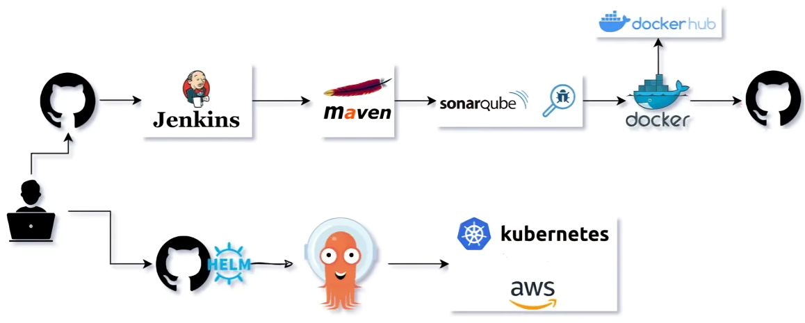

# DevOps Project README

This project demonstrates the setup and deployment of a CI/CD pipeline using Jenkins, SonarQube, and Argo CD on AWS infrastructure. The pipeline includes code quality checks, Docker image creation, and deployment of a Java Maven application to an EKS cluster.

## Table of Contents

1. [Project Overview](#project-overview)
2. [Architecture](#architecture)
3. [Prerequisites](#prerequisites)
4. [Setup Instructions](#setup-instructions)
   - [Setting up Jenkins](#setting-up-jenkins)
   - [Setting up SonarQube](#setting-up-sonarqube)
   - [Setting up EKS Cluster](#setting-up-eks-cluster)
   - [Setting up Argo CD](#setting-up-argo-cd)
5. [Pipeline Workflow](#pipeline-workflow)
6. [Deployment](#deployment)
7. [Conclusion](#conclusion)

## Project Overview

This project involves setting up a CI/CD pipeline to automate the process of building, testing, and deploying a Java Maven application. The key components used in this project are:

- Jenkins for continuous integration
- SonarQube for code quality analysis
- Docker for containerization
- Docker Hub for image repository
- EKS (Elastic Kubernetes Service) for container orchestration
- Argo CD for continuous deployment

## Architecture

## Prerequisites

Before you begin, ensure you have the following:

- AWS account with necessary permissions
- AWS CLI configured
- Kubernetes CLI (kubectl) installed
- Docker installed
- Jenkins, SonarQube, and Argo CD instances set up on AWS EC2

## Setup Instructions

### Setting up Jenkins

1. **Launch an EC2 Instance**: 
   - Use an Amazon Linux 2 AMI.
   - Configure security groups to allow HTTP, HTTPS, and a custom TCP port for Jenkins.

2. **Install Jenkins**: 
   - SSH into the EC2 instance.
   - Install Jenkins and Java, download Jenkins repository, import the Jenkins key, install Jenkins, and start the Jenkins service.

3. **Configure Jenkins**:
   - Access Jenkins through its web interface and complete the setup wizard.

### Setting up SonarQube

1. **Launch an EC2 Instance**:
   - Use an Amazon Linux 2 AMI.
   - Configure security groups to allow HTTP, HTTPS, and a custom TCP port for SonarQube.

2. **Install SonarQube**:
   - SSH into the EC2 instance.
   - Install Java and SonarQube, unzip SonarQube, and set appropriate permissions.

3. **Start SonarQube**:
   - Run SonarQube.

### Setting up EKS Cluster

1. **Create an EKS Cluster**:
   - Use the AWS Management Console or AWS CLI to create an EKS cluster.
   - Configure kubectl to interact with the new EKS cluster.

2. **Create a Node Group**:
   - Ensure the EKS cluster has at least two nodes.

### Setting up Argo CD

1. **Deploy Argo CD**:
   - Deploy Argo CD in the EKS cluster using the provided YAML manifests.

2. **Access Argo CD**:
   - Access the Argo CD server UI using port-forwarding and login to the Argo CD UI.

## Pipeline Workflow

1. **Run Jenkins Pipeline in Docker Container**:
   - Configure Jenkins to use a Docker container as an agent.

2. **Code Quality Check with SonarQube**:
   - Integrate SonarQube into the Jenkins pipeline for code quality analysis.

3. **Build Application and Docker Image**:
   - Build the application using the Dockerfile and create a Docker image.

4. **Push Docker Image to Docker Hub**:
   - Push the newly built Docker image to Docker Hub.

5. **Update Deployment File and Push to GitHub**:
   - Edit the deployment file with the new image tag and push it to the GitHub repository.

6. **Deploy with Argo CD**:
   - Argo CD syncs with the GitHub repository and deploys the updated application to the EKS cluster.

## Deployment

Follow the pipeline steps to ensure the application is built, tested, and deployed seamlessly:

1. Trigger the Jenkins Pipeline.
2. Monitor Code Quality Analysis in SonarQube.
3. Check Docker Image in Docker Hub.
4. Verify Deployment in Argo CD.

## Conclusion

This README provides a comprehensive guide to setting up a CI/CD pipeline using Jenkins, SonarQube, and Argo CD on AWS infrastructure. The pipeline ensures code quality, automates Docker image creation, and manages the deployment of a Java Maven application on an EKS cluster.

For any issues or further assistance, please refer to the respective documentation of Jenkins, SonarQube, Docker, and Argo CD.
